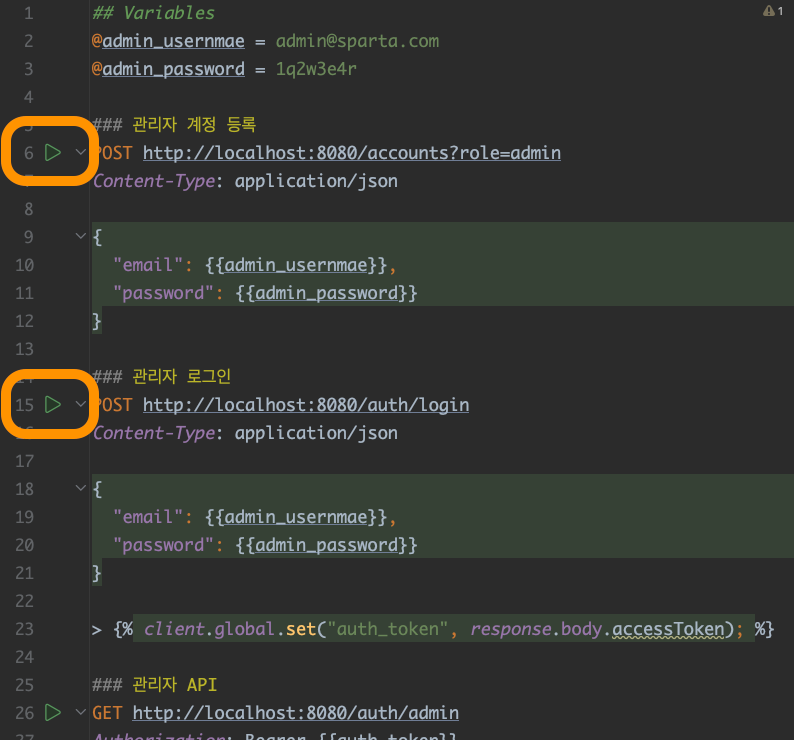

# nbcamp-lecture-spring-security

> `Spring Security` 예제 프로젝트입니다. \
> `Docker`와 `MariaDB`를 사용하고 있습니다. \
> (H2를 이용한 버전: [nbcamp-lecture-spring-security-h2](https://github.com/ssk910/nbcamp-lecture-spring-security-h2))

<b>주의할 점</b>
- 대부분 개발자는 예제로 공부하는데, 이런 예제는 주제에 집중할 수 있도록 단순화되어 있습니다.
- 이 때문에 개발자가 잘못된 접근 방식에 익숙해질 수 있으며, 예제로 배운 모든 내용이 좋은 습관이라고 착각할 수 있습니다. 
- 예제를 실제 상황에 적용할 때는 그대로 적용하지 말고, 한 번 더 생각해보는 것이 좋습니다.

## Installation

### Docker

#### 설치
> Docker Desktop 설치: https://www.docker.com/products/docker-desktop/ \
> Docker 사용이 끝난 후에는 PC의 메모리 낭비를 위해 container를 종료하거나, Docker를 종료해 주세요.

#### docker-compose

> 컨테이너 띄우기

`{프로젝트 루트}/docker/mariadb` 디렉토리로 이동합니다. \
아래 명령어를 실행합니다.

```shell
docker-compose up -d
```

## API TEST

## 테스트 방법

1. 스프링 서버 기동
2. http 파일에서 테스트

스크린샷에서 하이라이트 된 버튼을 각각 눌러서 request를 보내 테스트할 수 있습니다.


### 관리자 권한

`{프로젝트 루트}/api-test/admin-test.http` 파일을 열어 위 방법대로 테스트합니다.

### 유저 권한

`{프로젝트 루트}/api-test/customer-test.http` 파일을 열어 위 방법대로 테스트합니다.